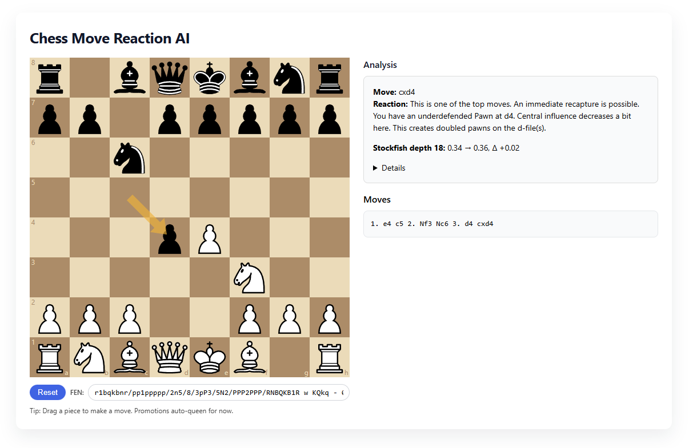

# Chess Move Reaction AI
Chess engines give raw scores and best lines, but not explanations, reasons, or reactions. Many chess players would appreciate AI that feels like a coach or informed spectator: it evaluates a move and reacts with both logic and tone (“Prudent choice! That move improves your position because of x, y, z.” or “Careful. That square is dangerous, your piece may be in danger.”). Beyond the scope of this project, the concept could be expanded into customized spectator/companion bots, i.e. famous players or commentators.

## Prereqs
- Node.js
- Python 3
- Optional but increases reaction precision: Chess Engine (Stockfish 17.1 for Windows x64 included in this repo's backend as `stockfish.exe`. Replace if using alternate OS https://stockfishchess.org/download/)

## Run Python venv and install requirements
```bash
cd backend

python -m venv .venv

# Windows:
.venv\Scripts\activate
# macOS/Linux:
source .venv/bin/activate

pip install -r requirements.txt
```

## Run backend 
```bash
uvicorn app:app --reload --port 8000
```

## Run frontend (new terminal)
```bash
cd frontend
npm install
npm run dev
```

## Screenshot:


## CLI usage (no server required)
```bash
# i.e. Starting position and move 1. e4
python cli.py --fen "rnbqkbnr/pppppppp/8/8/8/8/PPPPPPPP/RNBQKBNR w KQkq - 0 1" --move "e4"
```

## Notes
- v1 uses heuristics, first order logic, and propositional logic based on features extracted via `python-chess`
- Stockfish is **optional**... When configured, engine before/after evals are attached to the response.
- API: `POST /api/analyze` with `{ "fen": "...", "move": "Nf3|g1f3" }` returns `{ ok, normalized_move, reaction, details }`.
- Can be used via CLI or via `react-chessboard` + `chess.js` frontend for drag-and-drop moves.
- We accept both SAN (i.e. Nf3 -- human preferred) and UCI (fixed coordinate form i.e. g1f3 -- used by python-chess, engines, etc), store/log moves internally as UCI for consistency, and display explanations in SAN for readability.